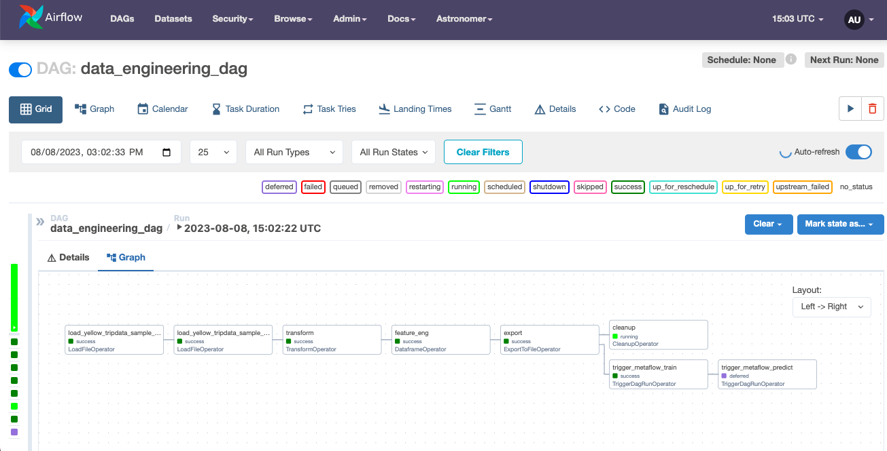

 

  
Overview
========
This demo provides an example of using [Metaflow](https://metaflow.org/) with Apache Airflow.  
  
When it comes to enterprise workflow orchestration different teams may have different needs filled by different tools.  In this demo the Data Engineering team has a pre-existing, managed infrastructure with Apache Airflow workflows creating datasets for the Machine Learning team.  The ML team is using Metaflow for model training, prediction and evaluation.  The ML team can build their Flows as they like and [export the flows as an Airflow DAG](https://docs.metaflow.org/production/scheduling-metaflow-flows/scheduling-with-airflow) for production execution in Airflow.  
  
[Airflow Data Aware Scheduling](https://docs.astronomer.io/learn/airflow-datasets) is used to interface the [Data Engineering DAG](http://localhost:8080/dags/data_engineering_dag/code) with the Metaflows in the `include/train_taxi_flow.py` and `include/predict_taxi_flow.py` files.
  
Project Services
================

This demo includes the following services running in local Docker containers.

- [Airflow](https://airflow.apache.org/):  This includes containers for the webserver, scheduler and triggerer.
- [Metaflow](https://metaflow.org/): This includes containers for the metadata service, UI and UI backend.
- [Minio](https://min.io/):  A local object storage to provide object versioning for Metaflow.  
- [Postgres](https://www.postgresql.org/): A database to hold state for Airflow and Metaflow.
  
Project Directory Contents
================

Your Astro project contains the following files and folders:

- dags: This folder contains the Python files for your Airflow DAGs. 
- Dockerfile: This file contains a versioned Astro Runtime Docker image that provides a differentiated Airflow experience. If you want to execute other commands or overrides at runtime, specify them here.
- include: This folder contains a sample Metaflow and the Minio data repository.
- requirements.txt: Contains Python packages to be installed in Airflow at startup.
- .env: This environment file provides variables for the Airflow, Metaflow and Minio services listed above.

Deploy Your Project Locally
===========================

Requirements:
- Docker and __Kubernetes__ services enabled.

Note: The Metaflow steps run as [KubernetesPodOperator](https://airflow.apache.org/docs/apache-airflow-providers-cncf-kubernetes/stable/operators.html) tasks in Airflow.  Therefore a Kubernetes service is needed.  This demo was built using [Docker Desktop](https://www.docker.com/products/docker-desktop/) which optionally includes Kubernetes services.  To enable Kubernetes:
- Open the Docker Desktop Dashboard
- Click on the Settings (wheel) in the top right
- Select Kubernetes
- Select __Enable Kubernetes__
- Click on __Apply & Restart__ 

1. Install Astronomer's [Astro CLI](https://github.com/astronomer/astro-cli).  The Astro CLI is an Apache 2.0 licensed, open-source tool for building Airflow instances and is the fastest and easiest way to be up and running with Airflow in minutes. 
  
For MacOS  
```bash
brew install astro
```
  
For Linux
```bash
curl -sSL install.astronomer.io | sudo bash -s
```
  
2. Setup the project directory:
```sh
git clone https://github.com/astronomer/airflow-metaflow-demo
cd airflow-metaflow-demo
cp -R ~/.kube/config include/.kube/
```

NOTE: This demo uses containers from [Outerbounds](https://outerbounds.com/) for the Metaflow service and UI backend.  The [Metaflow UI](https://gallery.ecr.aws/outerbounds/metaflow_ui) container is based on the nginx image which has platform dependencies. The Docker Compose environment used by the Astro CLI will build `metaflow-ui:local` (based on https://github.com/Netflix/metaflow-ui).
  
```bash
git clone https://github.com/Netflix/metaflow-ui include/metaflow-ui
```
  
3. Start Airflow, Metaflow and Minio on your local machine by running 
```sh
astro dev start
```
  
This command will spin up 8 Docker containers on your machine including:

- Postgres: Airflow's Metadata Database
- Webserver: The Airflow component responsible for rendering the Airflow UI
- Scheduler: The Airflow component responsible for monitoring and triggering tasks
- Triggerer: The Airflow component responsible for triggering deferred tasks
- Metaflow-ui: The Metaflow frontend UI.
- Metaflow-ui-backend: The Metaflow UI backend service.
- Metaflow-metadata-service: The metadata service for Metaflow
- Minio: An S3 compatible object storage service.
  
Access the UIs for your local project. 
- Airflow UI: http://localhost:8080/ login is `admin` password is `admin`
- Metaflow UI: http://localhost:3000/
- Minio: http://localhost:9001/ login is `minioadmin` password is `minioadmin`
  
4. Verify that all 8 Docker containers were created by running `docker ps`
  
5. Setup Airflow DAGs.
  
This demo environment has already been [configured](https://outerbounds.com/engineering/operations/airflow/#configuring-metaflow-for-airflow) to export Metaflow Flows to Airflow DAGs.

Since metaflow is already installed in the Airflow scheduler we will run the remaining commands from the Airflow Scheduler container.  Connect to the Airflow scheduler container with the Astro CLI.

```sh
astro dev bash -s
```

Trigger the Data Engineering and Feature Engineering DAG
```bash
airflow dags unpause data_engineering_dag
airflow dags trigger data_engineering_dag
```
  
Connect to the Airflow UI to track the status of the [Data Engineering DAG](http://localhost:8080/dags/data_engineering_dag/grid)

6. Run the Metaflow Train and Predict Flows in Metaflow.  This might be the case where ML teams are using the familiar interface of Metaflow for development before pushing to production.
```bash
cd /usr/local/airflow/include/
python train_taxi_flow.py run
python predict_taxi_flow.py run
```

Connect to the Metaflow UI to track the status of the [Train](http://localhost:3000/TrainTripDurationFlow/1) and [Predict](http://localhost:3000/PredictTripDurationFlow/2) Flows.

7. Export the training and predict Flows as Airflow DAGs for production.
```bash
cd /usr/local/airflow/dags
python ../include/train_taxi_flow.py --with kubernetes:image='pod_image:local' airflow create train_taxi_dag.py
python ../include/predict_taxi_flow.py --with kubernetes:image='pod_image:local' airflow create predict_taxi_dag.py
```

Note: By default the `dags` directory is only scanned for new files every 5 minutes.  For this demo the list interval was set to 10 seconds via `AIRFLOW__SCHEDULER__DAG_DIR_LIST_INTERVAL` in the `.env` file.  This is not advised in production.
    
8. Trigger the Train and Predict DAGs in Airflow
```bash
airflow dags trigger TrainTripDurationFlow
sleep 25
airflow dags trigger PredictTripDurationFlow
```  
7. Connect to the [Airflow UI](http://localhost:8080/) to track status of the DAG runs.


### TODO: setup data aware scheduling with metaflows airflow create.
### TODO: fix namespace issue so we don't have to use global
### TODO: tshoot --with environment:vars='{\"AWS_ACCESS_KEY_ID\": \"admin\", \"AWS_SECRET_ACCESS_KEY\": \"adminadmin\"}'
### TODO: How to run in astro hosted and metaflow sandbox